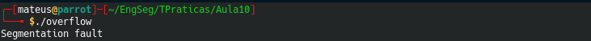
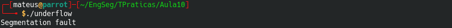

## Pergunta 1.1 ##

#### 1. Qual a vulnerabilidade que existe na função vulneravel() e quais os efeitos da mesma? ####
A vulnerabilidade que existe na função *vulneravel()* no código **overflow.c**, é a  vulnerabilidade de *Integer Overflow* ou Wraparound, pode ser aqui consultada  em maior detalhe https://cwe.mitre.org/data/definitions/190.html.
Esta vulnerabilidade ocorre quando o valor de um inteiro é demasiado grande para o valor origninal alocado, o que pode levar a este valor tornar-se extramamente pequeno ou negativo, isto torna-se uma vulnerabilidade de segurança, quando o software está dependente deste inteiro para fazer certas ações como controlar um ciclo, determinar tamanhos para alocação de memória, entre outros. No caso da função *vulneravel()*, essa vulnerabilidade poderia ser evitada se as variáveis `x`e `y` fossem validadas.

#### 2. Complete o main() de modo a demonstrar essa vulnerabilidade. ####

Para demonstrar a vulnerabilidade é necessário que o valor de `x*y` seja superior ao valor máximo permitido a se guardar num `size_t`. O código abaixo exemplifica uma forma de explorar esta falha.

```
int main() {
        char *matrix;
        vulneravel(matrix,100000000,100000000,'a');
}
```

#### 3. Ao executar dá algum erro? Qual? ####
Ao executar o código, ocorreu o erro **segmentation fault** pois não é possível alocar a quantidade de memória pretendida.



## Pergunta 1.2 ##

#### 1. Qual a vulnerabilidade que existe na função vulneravel() e quais os efeitos da mesma? ####
A vulnerabilidade encontrada na função *vulneravel()* do programa *underflow.c* é chamada *Buffer Underflow* e definida pelo CWE 124 (https://cwe.mitre.org/data/definitions/124.html). Esta falha ocorre quando o ponteiro tenta referenciar um local de memória anterior ao início do *buffer*. Na função *vulneravel()*, esta vulnerabilidade acontece devido ao fato da variável `tamanho` não ser validada.  

Como a variável `tamanho-real`é do tipo `size_t`, se a for passado o valor `0` para a variável `tamanho`, ocorrerá um *underflow*, pois a operação resultará em um valor negativo e o tipo `size_t` só aceita inteiros positivos.

#### 2. Complete o main() de modo a demonstrar essa vulnerabilidade? ####

Como citado anteriormente, ao passar o valor `0` para a variável `tamanho`, a variável `tamanho-real` passará a ser `-1` e resultará no *buffer underflow*.
```
int main() {
        vulneravel("aaa", 0);
}
```
#### 3. Ao executar dá algum erro? Qual? ####
Ao executar o código, o erro **segmentation fault** novamente, como na questão anterior, ocorreu.



#### 4. Utilize as várias técnicas de programação defensiva introduzidas na aula teórica para mitigar as vulnerabilidades. ####

Uma das formas de mitigar a vulnerabilidade encontrada na função *vulneravel()* do programa *underflow.c* seria validar a variável `tamanho` não apenas para o tamanho máximo, como já está feito no código, mas verificar se a variável também está dentro do limite mínimo de tamanho.

##### 4.1 Explique as alterações que fez. #####

Para aplicar a validação citada acima, foi alterada a condição `if (tamanho < MAX_SIZE)` para `if (tamanho < MAX_SIZE && tamanho > MIN_SIZE)` e assim, permitir que apenas valores não negativos sejam aceitos. 
