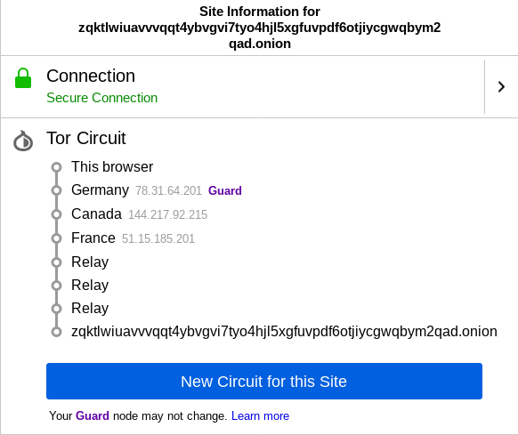

# Exercício 1 - TOR (The Onion Router)  
## Pergunta 1.1  
Não é possível garantir que o utilizador conseguirá um IP localizado nos EUA ao efetuar o comando `sudo anonsurf start`, pois para acessar algum site utilizando a rede TOR, o utilizador obtém uma lista dos nós da rede Tor fornecida pelo *Onion Router* que atua como *Directory Server* e feito isto, o utilizador escolhe aleatoriamente uma série de nós para chegar ao servidor de destino. Desta forma, o caminho percorrido para acessar o site sempre será definido aleatóriamente.  

## Pergunta 1.2  

O site The Hidden Wiki (http://zqktlwi4fecvo6ri.onion/wiki/index.php/Main_Page) foi escolhido para verificar o circuito.   estabelecido.

