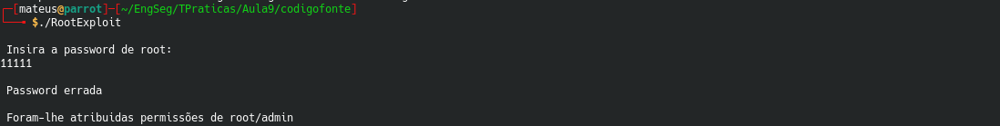
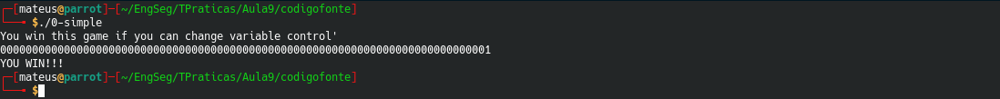
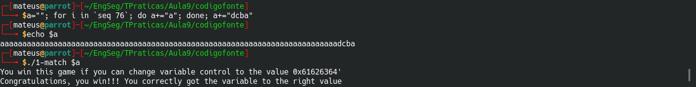

## Pergunta 1.1 - Buffer overflow em várias linguagens ##
\
O objectivo do programa é igual para todos, independetemente da linguagem, e este procura imprimir valores para 500 posições de um buffer, porém o buffer apenas tem alocadas 10 posições de memória, como tal seria de esperar o mesmo comportamento, tendo em conta que o algoritmo faz o mesmo, mas não é isso que se verifica, bem pelo contrário, isto deve-se ao facto que as diferentes linguagens tratam de maneira diferente este acesso indevido, que pode causar escrever fora dos limites de memória alocados, aceder a endereços de memória que o programa não deveria ter acesso posteriormente, pode causar a excecução de código malicioso e menos periogoso parar inesperadamente o programa.  

No C++, este percorreu as 500 posições, exedendo assim os limites de memória previamente alocados, demonstrando assim estar bastante vulnerável para este tipo de situações.  
Em Java, este não percorreu mais do que as 10 posições, e lançou um erro, pois este verifica os limites do buffer e previne os acessos fora deste limite.  
Em Python, também não percorreu mais do que as 10 posições, lançando um erro semelhante ao que foi lançado em java, "index out of range", isto ocorre pela mesma razão, ambas as linguagens perdem em performance para com o c, porém verificam os limites do buffer e previnem os acessos fora deste.  

## Pergunta 1.2 ##
Após analisar e testar os programas RootExploit.c e 0-simple.c, foi encontrada vulnerabilidade **Stack Buffer Overflow**, devido ao fato do *input* recebido pela função `gets` não efetua uma verificação de tamanho.  

**RootExploit.c:**  
No programa RootExploit.c, duas variáveis são declaradas logo no início:  
`pass`: inteiro, inicializada com o valor 0 e de 4 bytes;   
`buff`: array de caracteres de 4 bytes.  

Os valores são colocados na *stack* que cresce dos endereços mais altos da memória para os mais baixos, porém a escrita é feita ao contrário e a indexação é dos endereços mais baixos para os mais altos, sendo assim, no programa RootExploit, os 4 bytes da variável `pass` são alocados primeiro e em seguida, são alocados os 4 bytes da variável `buff`.   

Neste programa, ao inserir 5 caracteres no *input* (variável `buff`), esse quinto caracter irá ultrapassar o espaço de memória reservado para a variável e será escrito na variável `pass` que está alocada logo após. Se o valor desse caracter for diferente de 0, o programa reconhecerá a `pass` como verdadeira e validará a condição onde só deveria ser validade se o *input* correspondesse à *password* correta.  

  

**0-simple.c**  
Já no programa 0-simple.c, as variáveis são:  
`control`: inteiro declarada mas nao inicializada;  
`buffer`: array de 64 bytes.  

Diferente do  RootExploit.c, para explorar o *Stack Buffer Overflow* neste programa é necessário inserir um *input* com no mínimo 65 bytes (77 caracteres) para transbordar o espaço de memória reservado para a variável `buffer`. Assim como no programa anterior, se o byte extra for diferente de zero, o programar escreverá o valor deste byte no endereço de memória da variável `control`, a validará e o programa retornará "YOU WIN!!!"  

  

## Pergunta 1.3 ##
O programa **ReadOverflow.c** aloca um *buffer* de tamanho 100 e pede ao utilizador para inserir o número de caracteres que o *input* terá. Feito isto, é pedido que o utilizador insira a frase desejada. Por não colocar um terminador da string, este programa possibilita que o utilizador insira um número maior que o *buffer* e maior que a frase inserida, expondo então, o conteúdo da memória.  

Isso ocorre porque o programa ao percorrer o ciclo sem realizar uma verificação do tamanho da frase, além de imprimir os caracteres inseridos no *input* da frase, imprimirá também os restantes que faltam até atingir o número de caracteres indicado de posições sucessivas da memória.  

A figura abaixo exemplifica uma exploração desta vulnerabilidade inserindo o número 64000 para a quantidade de caracteres desejada, mas inserindo apenas um caracter como frase.  

## Pergunta 1.4 ##

Nesta pergunta de forma a conseguirmos o resutlado esperado, é necessário traduzir o resultado pedido em hexadecimal para ascii para verificarmos quais são os caracteres necessários, e verificamos que são abcd, porém como os números hexadecimais são guardados na memória em little endian, detrás para a frente, este deve ser introduzido ao contrário dcba, visto que estamos aceder diretamente na memória, e como o buffer está alocado para 64 caracteres, devem ser introduzidos inicialmente 64 caracteres para exceder os espaço alocado, e poder ser lida a variavél que desejamos, neste caso dcba.  

  

## Pergunta 1.5 ##
## Pergunta 1.6 ##
